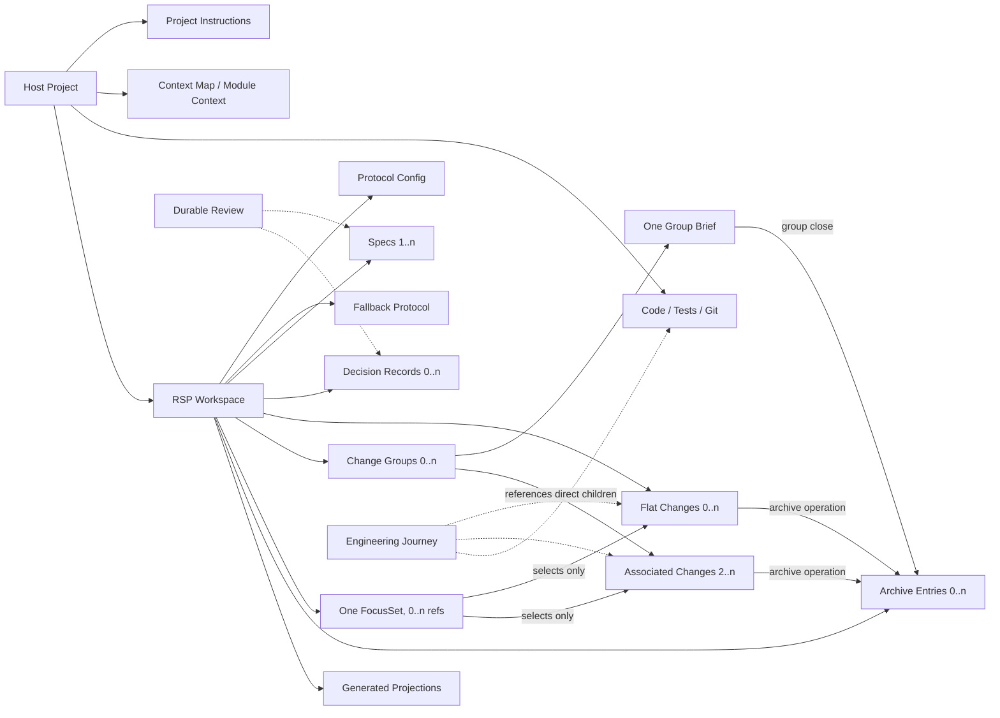

# RSP Engineering Domain Model

## Position

This model defines the proposed RSP core protocol, its surrounding engineering capabilities, and the maintainer-research boundary. It synthesizes completed reports for OpenSpec, Spec Kit, Matt skills, and planning-with-files with the earlier RSP design discussion.

The model is complete research but not implemented product truth. Current `.rsp/specs/design.md`, bundled rules, and CLI behavior remain authoritative until later selected Changes implement and verify individual recommendations.

## Current and Target Boundary

### Current authority

- Consumer projects use `.rsp/rules/rsp-rules.md` and optional `.rsp/rules/project-rules.md`.
- Open work is one Markdown file per Change, including names with directory segments.
- `focus.d/` selects open Changes.
- Durable current facts live in `.rsp/specs/`.
- Only `open -> archived` is persisted; readiness and durable-review guidance are derived.
- The CLI does not yet recognize Change Group briefs, Decision Records as a distinct document role, or `.rsp/rsp-rules.md` as the fallback path.

### Proposed target

- The enclosing project retains ownership of code, Git, project instructions, and module context.
- An embedded RSP Workspace owns current work, stable facts, durable decision rationale, completed history, machine configuration, and a minimal fallback protocol.
- Work is either one flat Change or one shallow Change Group containing `brief.md` plus direct child Change files.
- Core `.rsp/` paths remain fixed. Only external context routing and one authoritative Decision Record path may be configured.
- Recursive groups, cross-repository coordination, complex dependency graphs, tracker synchronization, backlinks, and multi-workspace orchestration are outside the model.

## Bounded Contexts

### Host Project

The Host Project is outside RSP ownership. It owns code, tests, Git, nearest `AGENTS.md` instructions, `CONTEXT-MAP.md`, module `CONTEXT.md`, and any external delivery system. An RSP-enabled Project is simply a Host Project containing one RSP Workspace.

### RSP Workspace

The RSP Workspace is the protocol boundary rooted at `.rsp/`. It is not one transaction-sized aggregate. It contains four cooperating core subdomains:

- **Work Coordination:** Change, Change Group, FocusSet, verification evidence references, and derived next actions.
- **Durable Knowledge:** Spec, Decision Record, Durable Review, and explicit promotion of lasting outcomes.
- **History:** authoritative archived Changes and archived Group Briefs, with bounded query projections derived on demand.
- **Protocol Operations:** Protocol Config, Fallback Protocol, deterministic checks, path resolution, locking, repair, and archive coordination.

### Engineering Orchestration

Describes a derived journey through clarification, shaping, implementation, verification, durable review, archive, and delivery. Stages, gates, slices, evidence summaries, and next actions are coordination projections; they never become competing `.rsp/` lifecycle state.

### Capability Distribution

Owns packaging and placement of optional reusable rules, skills, command prompts, and capability-local resources. Installation does not grant a capability ownership of RSP work state.

### Maintainer Research

Owns pinned upstream candidates, source Distillations, cross-source Models, Recommendations, and Adoption provenance for improving RSP. It is excluded from published/runtime RSP and crosses into product work only through a selected normal Change.

## Ubiquitous Language

### Core and external context

| Term | Owner | Meaning | Not the same as |
| --- | --- | --- | --- |
| Host Project | External | The enclosing project that owns code, tests, Git, instructions, context, and delivery systems | An RSP Workspace or controller run |
| RSP-enabled Project | Descriptive | A Host Project containing an RSP Workspace | A separate project type or persisted state |
| RSP Workspace | Core boundary | The `.rsp/` protocol instance embedded in one Host Project | A project-wide aggregate, repository fleet, or workspace database |
| Project Instruction | Host Project | Scoped operating guidance in the nearest `AGENTS.md` | RSP fallback rules or stable architecture facts |
| Context Map | Host Project | Optional root routing from areas/modules to contextual documents | A copy of module context inside `.rsp/` |
| Module Context | Host Project | Module vocabulary, current architecture, and boundaries in `CONTEXT.md` | Project instructions, full Specs, or Decision Records |
| Protocol Config | RSP Workspace | Small machine-readable settings for supported integrations and protocol options | Human rules, workflow prose, or a configurable state machine |
| Fallback Protocol | RSP Workspace | Minimal tool-agnostic RSP operating constraints used when the RSP skill is unavailable | Project instructions or detailed skill procedure |
| Spec | Durable Knowledge | A stable current fact, boundary, default, or behavior future work must reread | Rationale, a proposed delta, execution plan, or history |
| Decision Record | Durable Knowledge | Lasting rationale, alternatives, tradeoffs, and consequences for a hard-to-reverse decision | A current-fact Spec, task list, or transient discussion |
| Change | Work Coordination | One executable single-file record with fixed Proposal, Spec, Design, Tasks, Verify, and Blockers sections | A Group Brief, controller run, Git commit, or durable Spec |
| Change Group | Work Coordination | An optional one-level coordination object for multiple direct child Changes sharing one goal and completion contract | A recursive initiative, folder namespace, or alternative issue tracker |
| Group Brief | Work Coordination | `changes/<group>/brief.md`, which owns group goal, scope, shared constraints, slice map, completion conditions, durable outcomes, and group blockers | An executable Change or duplicate child progress log |
| FocusSet | Work Coordination | The single reference set in `focus.d/` containing zero or more open executable Change names | Priority, status, a selected Group, or inferred current work |
| Selected Change | Work Coordination / Orchestration | One explicitly selected open Change; ambiguity must be rejected | A Change Group or the whole FocusSet |
| Durable Review | Durable Knowledge | The semantic gate deciding whether completed work changes Specs, requires a Decision Record, or belongs only in history | Automatic delta merge or persisted approval state |
| Durable Decision | Durable Knowledge | The result of Durable Review: Spec update yes/no, Decision Record yes/no, targets, facts/rationale, and archive readiness | A standalone lifecycle entity |
| Archive Entry | History | The dated historical form of a completed Change or Group Brief | Current truth or an additional workflow state |
| Generated Projection | Protocol Operations | An index, diagnostic, readiness result, or next action derived from owned artifacts | An editable authority source |

### Peripheral model

| Term | Context | Maturity | Meaning |
| --- | --- | --- | --- |
| Engineering Journey | Engineering Orchestration | Derived | Ordered stages projected over existing owners |
| Stage | Engineering Orchestration | Derived | A step with input, owner, output, gate, and next action |
| Slice | Engineering Orchestration | Derived | A bounded, independently verifiable portion of one Selected Change |
| Gate | Engineering Orchestration | Derived | Deterministic check or semantic judgment controlling continuation |
| Evidence | Engineering Orchestration | Derived | Tests, builds, review findings, runtime observations, or other gate support |
| Next Action | Engineering Orchestration | Derived | Guidance calculated from artifacts, evidence, blockers, and authority |
| Capability Level | Engineering Orchestration | Derived | L0-L3 classification of removable assistance |
| Managed Controller | Engineering Orchestration | Candidate | Future opt-in single-Workspace controller with ignored run-local state |
| Capability Package | Capability Distribution | Observed | One skill plus only its owned scripts, references, assets, and metadata |
| Upstream Source | Maintainer Research | Maintainer-only | External repository declared in `upstreams.yaml` |
| Candidate Revision | Maintainer Research | Maintainer-only | Immutable Git candidate revision, independent of checkout `HEAD` |
| Distillation | Maintainer Research | Maintainer-only | Evidence-backed semantic conclusions for one source revision |
| Cross-source Model | Maintainer Research | Maintainer-only | Synthesis citing completed Distillations |
| Recommendation | Maintainer Research | Maintainer-only | Stable-ID option with proposed owner and adoption mode |
| Adoption | Maintainer Research | Maintainer-only | Selection through a normal Change, distinct from candidate acceptance |

## Relationships



Containment in a Change Group does not make child Changes part of the same transaction aggregate. Each child remains independently executable and archivable.

## Consistency and Ownership

- **RSP Workspace is a protocol boundary, not a single aggregate root.** Commands touch only the consistency owners needed for one operation and use a workspace lock when coordinating filesystem mutations.
- **Change is the executable work aggregate.** Its six sections are facets of one record and cannot be split into separately owned task/spec/verify files.
- **Change Group is a shallow coordination aggregate.** Its `brief.md` owns group-wide meaning and references direct child Change aggregates; it does not own child progress or introduce child statuses.
- **FocusSet is an independent selection owner.** It references only open executable Changes. Group Briefs and directories are not focusable.
- **Each Spec and Decision Record owns one durable topic.** Specs own what is currently true; Decision Records own why a lasting choice was made.
- **Archive is a coordinating domain operation.** It moves a Change or eligible Group Brief, clears affected focus references, and rebuilds projections without changing current truth automatically.
- **Protocol Config and Fallback Protocol have narrow interfaces.** They cannot absorb project instructions, module context, arbitrary paths, workflow schemas, or status vocabularies.
- **Host Project documents keep external ownership.** RSP may discover and reference `AGENTS.md`, `CONTEXT-MAP.md`, and `CONTEXT.md` but never copies or silently rewrites them beyond its explicitly managed navigation block.

## Core Invariants

1. One Host Project contains at most one RSP Workspace rooted at `.rsp/`.
2. Removing every optional skill or controller leaves the RSP Workspace readable and structurally operable through its files and Fallback Protocol.
3. Every executable Change is one Markdown file with explicit `kind` and the fixed six sections.
4. A Change is either flat at `changes/<change>.md` or a direct child at `changes/<group>/<change>.md`.
5. A Change Group declares at least two associated Changes in its Group Brief. Its open directory contains exactly one `brief.md` plus zero or more still-open direct child Change files and no subdirectories; archived children remain associated through matching archive entries.
6. Change Groups cannot nest, reference cross-repository children, or own arbitrary attachment/spec/task subtrees.
7. `changes/<name>.md` and `changes/<name>/` cannot coexist because they would share one logical identity.
8. The FocusSet contains only open executable Changes; it never selects a Group Brief, directory, archived Change, or inferred candidate.
9. Change and Change Group persist only `open` and `archived`; readiness, blockedness, verification, progress, and completion are derived.
10. A Group is eligible to close only when it has no open direct child Changes, group completion conditions are verified, group blockers are absent, and group Durable Review is complete.
11. Project Instructions and Module Context remain outside RSP Workspace ownership.
12. Specs own current durable facts; Decision Records own lasting rationale; Changes and archives may cite but not duplicate them as competing truth.
13. Fallback Protocol contains only minimal RSP operation constraints and never becomes the project rule store.
14. Archive and Group close never mechanically promote Change content into Specs or Decision Records.
15. Generated Projections are rebuildable and never accepted as editable truth owners.
16. Core `.rsp/` locations are fixed; configuration cannot redefine work, focus, specs, or archive roots.
17. Recursive hierarchy, cross-repository coordination, complex dependency graphs, tracker synchronization, backlinks, and multi-workspace orchestration are outside RSP and receive no reserved core fields.
18. Managed Controller state stays ignored outside `.rsp/` and cannot grant commit, push, publication, deletion, or approval authority.

## Target Filesystem Model

```text
Host Project/
├── AGENTS.md
├── CONTEXT-MAP.md                 # optional, externally owned
├── <module>/
│   ├── AGENTS.md                  # optional, externally owned
│   └── CONTEXT.md                 # optional, externally owned
└── .rsp/
    ├── config.yaml
    ├── rsp-rules.md               # minimal fallback protocol
    ├── specs/
    │   ├── 00-index.md            # generated direct-child navigation
    │   ├── design.md
    │   ├── decisions/             # default; excluded from Specs indexes
    │   └── <domain>/
    │       ├── 00-index.md
    │       └── <spec>.md
    ├── changes/
    │   ├── <change>.md
    │   └── <group>/
    │       ├── brief.md
    │       ├── <change-a>.md
    │       └── <change-b>.md
    ├── focus.d/
    └── archives/
        ├── INDEX.md
        ├── YYYY-MM-DD_<change>.md
        └── <group>/
            ├── YYYY-MM-DD_<change-a>.md
            └── YYYY-MM-DD_brief.md
```

Allowed work paths are exactly:

```text
changes/<change>.md
changes/<group>/brief.md
changes/<group>/<change>.md
```

Paths such as `changes/<group>/issues/<change>.md`, `changes/<group>/<subgroup>/<change>.md`, or cross-workspace references are outside the core model.

## Change Group Contract

Use a Change Group only when two or more independently executable Changes share a goal, shared constraints, or end-to-end completion conditions. A large task that still has one consistency and verification boundary remains one flat Change with sliced Tasks.

`brief.md` owns these sections:

```text
Goal
Scope
Shared Constraints
Slices
Completion Conditions
Durable Outcomes
Blockers
```

- `Slices` is the authoritative list of associated Change identities and their intended boundaries or simple blocking order; it does not duplicate progress status. Every direct child file must be declared, and every declared child must resolve to either an open Change or its matching Archive Entry.
- Child files retain the normal six-section Change contract and their own verification evidence.
- Reading a child Change also reads the sibling Group Brief before implementation.
- Focus and implementation select a child Change, never the Group Brief.
- Child Changes archive independently under the matching archive group.
- Group close archives the Group Brief only after the group completion gate passes.

## State and Derived Observations

### Change lifecycle

```text
changes/<change>.md -> archives/YYYY-MM-DD_<change>.md
changes/<group>/<change>.md -> archives/<group>/YYYY-MM-DD_<change>.md
```

### Change Group lifecycle

```text
changes/<group>/brief.md -> archives/<group>/YYYY-MM-DD_brief.md
```

The second transition is allowed only after all direct child Change transitions and the group completion gate.

### Selection

Focus markers independently reference zero or more open Changes. Selection does not alter Change or Group lifecycle, and multiple markers carry no implicit priority.

### Derived only

- ready or not ready;
- blocked or unblocked;
- verified or missing evidence;
- group progress and group completion;
- durable update or Decision Record needed;
- next action and recommended capability level.

## Context and Read Order

For target RSP-tracked work:

1. Read the nearest `AGENTS.md` for Host Project or module instructions.
2. Read root `CONTEXT-MAP.md` when present, then the relevant nearest `CONTEXT.md`.
3. Load the RSP skill; if unavailable, read `.rsp/rsp-rules.md` as the minimal fallback protocol.
4. Read `focus.d/` and select one explicit Change when the FocusSet is ambiguous.
5. If the Change is grouped, read the sibling `brief.md`, then the Change.
6. Read only relevant Specs and the configured Decision Record path.

The RSP managed `AGENTS.md` block remains navigation. It does not absorb project rules, module context, Specs, or Decision Records.

## Configuration Boundary

Core `.rsp/` paths stay fixed for cross-project determinism. Target configuration may name external integration points such as:

```yaml
version: 2

context:
  map: CONTEXT-MAP.md
  file_name: CONTEXT.md

decisions:
  path: .rsp/specs/decisions
```

An existing project may select one external authoritative Decision Record path such as `docs/adr`. Configuration must not define core paths, status values, focus selection fallbacks, recursive layouts, or workflow graphs.

## Engineering Journey

| Stage | Required input | Owner | Output | Gate | Next action |
| --- | --- | --- | --- | --- | --- |
| Context discovery | User goal and touched area | Host Project instructions/context | Bounded intent, vocabulary, constraints | Relevant scope is known or ambiguity exposed | Select or create work |
| Protocol entry | RSP skill or Fallback Protocol | Protocol Operations | Safe operating constraints | RSP Workspace is valid | Resolve FocusSet |
| Work shaping | Intent and relevant durable knowledge | Flat Change or Group Brief plus direct child Change | Executable Change with explicit boundaries | One independently verifiable slice exists | Implement slice |
| Implementation | Selected Change and codebase truth | Host Project code/tests plus Change Tasks | Bounded behavior change | Authority and group constraints preserved | Verify |
| Verification and review | Diff, Change Spec/Verify, project checks | Project verification plus semantic reviewer | Evidence, findings, corrected Tasks/Blockers | Intended behavior and standards demonstrated | Continue or durable review |
| Durable review | Completed evidence and changed facts/rationale | Durable Knowledge | Spec update, Decision Record, or history-only decision | Each lasting outcome has one owner | Archive Change or close Group |
| History transition | Ready Change or eligible Group Brief | History operation | Dated Archive Entry and rebuilt projections | Deterministic warnings visible and semantic review complete | Deliver or finish |

## Progressive Capability Contract

- **L0 Protocol:** readable RSP Workspace, fixed paths, deterministic operations, and Fallback Protocol.
- **L1 Guided engineering:** RSP skill assists selection, shaping, readiness, durable review, and archive without owning implementation truth.
- **L2 Optional capability:** clarification, domain modeling, diagnosis, TDD, review, or other selected skills attach to named journey stages and return output to existing owners.
- **L3 Managed delivery candidate:** an opt-in controller may repeat bounded implementation, verification, and review inside one RSP Workspace. Its state stays ignored outside `.rsp/`, and cross-repository orchestration remains out of scope.

Every higher level is removable without invalidating L0.

## Maintainer Research and Capability Packaging

| Upstream or repository asset | Local owner | Rule |
| --- | --- | --- |
| Reusable end-user skill and owned resources | `skills/<name>/` | Publish only after a demonstrated journey gap, license review, adaptation mapping, and behavioral evaluation |
| Maintainer-only research or maintenance skill | `.agents/skills/<name>/` | Exclude from npm/runtime product unless a separate Change selects it |
| Deterministic repository maintenance | `scripts/` | Prefer scripts when behavior must be reproducible without agent judgment |
| Source Distillations and cross-source Models | `research/` | Preserve evidence and Recommendations; never load as runtime authority |
| Mechanical evidence and upstream checkouts | `.cache/` | Disposable and never executed during research |
| Controller run state | Ignored controller-owned storage outside `.rsp/` | Never becomes protocol truth |

Candidate acceptance records reviewed provenance in `upstreams.lock`; only Adoption through a normal Change may affect product files.

## Scenario Checks

### Simple change

`changes/fix-login.md` owns the whole work record. No Group Brief is created merely for symmetry.

### Several slices share one goal

`changes/new-frontend/brief.md` owns the shared migration goal and end-to-end completion conditions. Direct child files own independently executable authentication and UI slices. No `issues/` directory or nested subgroup exists.

### A child is focused

The marker resolves to `new-frontend/01-auth-session`. The Group Brief is required context, but focus and readiness operate on the child Change.

### All child Changes are archived

The Group is not automatically closed. Its end-to-end Completion Conditions, group blockers, and Durable Review are checked; only then is its Brief archived.

### A proposed subgroup appears

`changes/new-frontend/login/01-form.md` is rejected. The work must be flattened to a direct child Change, kept as one Change with Tasks, or treated as outside RSP when it truly requires recursive coordination.

### Cross-repository dependency appears

RSP may contain an ordinary Markdown link for human context, but it creates no cross-workspace entity, backlink, resolver, synchronization state, or orchestration contract.

### Implementation discovers current fact and rationale

The current fact updates one Spec. Lasting rationale and tradeoffs update or create one Decision Record. The Change and archive cite those owners without duplicating them.

### Managed controller is interrupted

Controller-local recovery state may resume one Workspace journey, but the RSP Workspace remains valid from its own files. The controller cannot fabricate evidence, close a Group, archive work, or gain delivery authority.

## Intentional Differences from Sources

- OpenSpec uses a multi-file Change folder; RSP keeps each executable Change in one file and permits only a separate shallow Group Brief when several Changes share a parent contract.
- Spec Kit uses a feature artifact tree; RSP extracts input/owner/output/gate dependencies without copying spec/plan/research/contracts/tasks files.
- Matt local issues uses `PRD.md + issues/` with tracker statuses; RSP uses generic `brief.md + direct Changes`, explicit FocusSet, and only open/archived persistence.
- planning-with-files persists transient planning state; RSP keeps controller memory outside `.rsp/` and promotes only selected lasting outcomes.
- OpenSpec's retired initiative/workspace direction warns against cross-root graphs and resolver state; RSP Change Groups are strictly local, shallow, and non-recursive.

## Rejected

- Treating the Host Project or RSP Workspace as one transaction-sized aggregate.
- Keeping project rules in `.rsp/rules/project-rules.md` in the target model.
- Treating `AGENTS.md`, `CONTEXT-MAP.md`, or `CONTEXT.md` as RSP-owned content.
- Creating a Change directory without a Group Brief semantic owner.
- Using `_standalone/`, `initiatives/`, or `issues/` wrapper directories when flat Changes and one shallow Group suffice.
- Recursive Change Groups, arbitrary attachments, child specs/design/tasks trees, or alternative child schemas.
- Persisting `active`, `ready-for-agent`, `in-progress`, `verified`, `done`, or group progress as RSP lifecycle state.
- Configurable core paths, status vocabularies, selection order, workflow schemas, or dependency graphs.
- Automatically promoting Change deltas into Specs or Decision Records.
- Giving external links special tracker, cross-workspace, parent, backlink, or orchestration fields.
- Installing an entire upstream suite or adapter tree to obtain one capability.
- Promoting this research model as implemented product truth before CLI, rules, skills, documentation, migration, and behavior tests agree.

## Recommendations

- **C1 — Implement target path and instruction ownership first (`independent-reimplementation`).** Add `.rsp/rsp-rules.md` as the minimal fallback, preserve legacy `.rsp/rules/rsp-rules.md` during migration, move project instruction ownership to nearest `AGENTS.md`, and update managed navigation/read order.
- **C2 — Add Decision Record ownership separately (`independent-reimplementation`).** Support one default `.rsp/specs/decisions` path and one optional external authoritative path without making all Specs ADRs or adding a second path.
- **C3 — Introduce a typed WorkRef before Change Groups (`independent-reimplementation`).** Resolve flat Change, direct grouped Change, and Group Brief explicitly while preserving legacy behavior; reject unsupported depth deterministically.
- **C4 — Add Change Group as the only composite work shape (`independent-reimplementation`).** Require `brief.md`, direct child Changes, child-only focus, independent child archive, derived group completion, and explicit Group close. Evaluate clean restraint so simple work remains one Change.
- **C5 — Keep external coordination out of the product (`model-only`).** Do not reserve schema or extension points for cross-repository, recursive, tracker, backlink, or multi-workspace behavior.
- **C6 — Evaluate two-axis review after the core path is implemented (`adapt`).** Adapt Matt's independent Standards and Spec review against Selected Change and optional Group Brief authority, with missing-spec restraint and no implicit commit.
- **C7 — Specify single-Workspace managed delivery only after gates stabilize (`independent-reimplementation`).** Require isolated run state, append-only evidence, bounded retry/stall handling, opt-out, and explicit authority stops.

## Promotion Boundary

No recommendation in this model is implemented by completing this research Change. Each product step requires a selected `.rsp/changes` item citing this model, the relevant source report or reports, the recommendation ID, and adoption mode.
